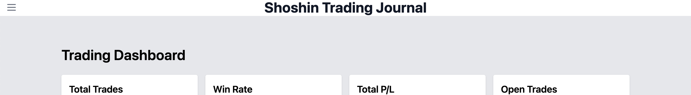

# Shoshin Trading Journal

## Description

Shoshin Trading Journal is a web application designed to help traders track and analyze their trading activities. The name "Shoshin" comes from Zen Buddhism, meaning "beginner's mind," emphasizing the importance of an open, eager, and unprejudiced mind in trading.

This application allows users to:
- Log their trades with detailed information
- View a dashboard with basic trading statistics
- Analyze their trading patterns and performance

I ended up creating this application because as a trader myself I wanted to create a journal application to help myself but potentially be something bigger. 

## Getting Started

You can access the deployed application here: [Deployed Shoshin Trading Journal](https://your-deployed-app-url.com)

For more information about the development process and planning materials, check out our [Project Planning Document](https://trello.com/b/fXqwS19D/shoshin)

## Technologies Used

- Javascript
- HTML
- Node.js
- Express.js
- MongoDB
- Mongoose
- EJS (Embedded JavaScript templating)
- Tailwind CSS

## Attributions

- [Tailwind CSS](https://tailwindcss.com/) - A utility-first CSS framework
- [Express.js](https://expressjs.com/) - Web application framework for Node.js
- [MongoDB](https://www.mongodb.com/) - Document-oriented database program
- [Mongoose](https://mongoosejs.com/) - MongoDB object modeling for Node.js
- [Youtube](youtube.com) - Sidebar Help
- [Stack Overflow](stackoverflow.com) - Sidebar Help
## Next Steps

Future enhancements planned for Shoshin Trading Journal include:

1. Implementing advanced data visualization for trade analysis
2. Instead of a note feature, adding a real journal feature for traders to record their thoughts and strategies
3. Integrating with popular trading platforms for automatic trade importing
4. Developing a mobile app for on-the-go trade logging
5. Live News Tracker implementing forexfactory.com data
6. Backtesting feature (SUPER STRETCH)
